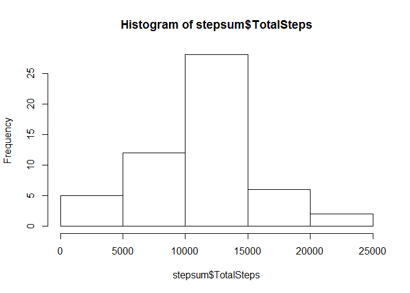

# Reproducible Research: Peer Assessment 1


## Loading and preprocessing the data

```r
mydata<-read.table("activity.csv", header=TRUE, sep=',', na.strings='NA')
mydata$newdate<-as.Date(as.character(mydata$date), "%Y-%m-%d")
```


## What is mean total number of steps taken per day?
use dplyr to summarize data by date and calculate total steps

```r
library(dplyr)
```

```
## 
## Attaching package: 'dplyr'
## 
## The following object is masked from 'package:stats':
## 
##     filter
## 
## The following objects are masked from 'package:base':
## 
##     intersect, setdiff, setequal, union
```

```r
tbl<-tbl_df(mydata)
bydate<-group_by(tbl, newdate)
stepsum<-summarize(bydate, TotalSteps=sum(steps))
head(stepsum)
```

```
## Source: local data frame [6 x 2]
## 
##      newdate TotalSteps
## 1 2012-10-01         NA
## 2 2012-10-02        126
## 3 2012-10-03      11352
## 4 2012-10-04      12116
## 5 2012-10-05      13294
## 6 2012-10-06      15420
```
Here is a histogram, mean and median of the total number of steps taken each day:

```r
hist(stepsum$TotalSteps)
```

 

```r
meanst<-mean(stepsum$TotalSteps, na.rm=T)
medst<-median(stepsum$TotalSteps, na.rm=T)
```
The mean of total daily steps is 1.0766189\times 10^{4} and median is 10765.

## What is the average daily activity pattern?

```r
 intsum<-tbl%>%filter(!is.na(steps))%>%group_by(interval)%>%summarize(AvgSteps=mean(steps))
plot(intsum$interval, intsum$AvgSteps, type='l')
```

 

```r
topSteps<-intsum%>%arrange(desc(AvgSteps))
```
The interval with the most steps is 835, 206.1698113 were taken on average

## Imputing missing values
we will use mean value for the interval to replace NA in steps

```r
mergemeans<-merge(mydata, intsum, by="interval")
mergemeans$newSteps<-ifelse(is.na(mergemeans$steps), mergemeans$AvgSteps, mergemeans$steps)
myNewData<-select(mergemeans, steps=newSteps, newdate, interval)
```
Summarize and recreate daily histogram:

```r
myNewSum<-myNewData%>%group_by(newdate)%>%summarize(TotalSteps=sum(steps))
hist(myNewSum$TotalSteps)
```

 

```r
meanst2<-mean(myNewSum$TotalSteps, na.rm=T)
medst2<-median(myNewSum$TotalSteps, na.rm=T)
```
The new mean of total daily steps is 1.0766189\times 10^{4} and median is now 1.0766189\times 10^{4}.
As you might expect, replacing the missings with means increases the number of values in the middle of the distribution in the histogram, but changes the median very little and the mean not at all. 

## Are there differences in activity patterns between weekdays and weekends?

```r
myNewData$day<-weekdays(myNewData$newdate)
myNewData$weekend<-ifelse((myNewData$day=='Saturday'|myNewData$day=='Sunday'), 1, 0)
myNewData$weekend.f<-factor(myNewData$weekend, labels=c("weekday", "weekend"))
myNewSum<-myNewData%>%group_by(weekend.f, interval)%>%summarize(TotalSteps=sum(steps))
library(lattice) 
xyplot(myNewSum$TotalSteps~myNewSum$interval|myNewSum$weekend.f, type="b",
        main="Activity Patterns on Weekdays and Weekends",
        xlab="5-minute interval", ylab="Total Steps",
        layout=c(1,2))
```

 
Not surprisingly, there is significantly more activity on weekdays and it starts earlier than on weekends!
